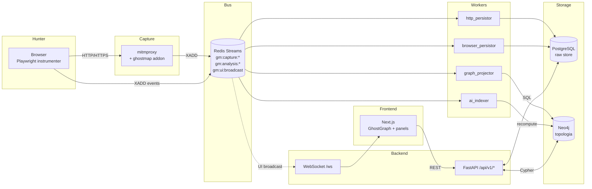

# System overview (mermaid)

```mermaid
flowchart LR
  subgraph Hunter
    BR[Browser<br/>Playwright instrumenter]
  end
  subgraph Capture
    MIT[mitmproxy<br/>+ ghostmap addon]
  end
  subgraph Bus
    R[(Redis Streams<br/>gm:capture:* <br/>gm:analysis:* <br/>gm:ui:broadcast)]
  end
  subgraph Workers
    P1[http_persistor]
    P2[browser_persistor]
    GP[graph_projector]
    AI[ai_indexer]
  end
  subgraph Storage
    PG[(PostgreSQL<br/>raw store)]
    NEO[(Neo4j<br/>topologia)]
  end
  subgraph Backend
    API[FastAPI /api/v1/*]
    WS[WebSocket /ws]
  end
  subgraph Frontend
    UI[Next.js<br/>GhostGraph + panels]
  end

  BR -- HTTP/HTTPS --> MIT
  MIT -- XADD --> R
  BR -- XADD events --> R
  R --> P1 --> PG
  R --> P2 --> PG
  R --> GP --> NEO
  R --> AI
  AI -- recompute --> NEO
  API <-->|SQL| PG
  API <-->|Cypher| NEO
  WS --> UI
  R -. UI broadcast .-> WS
  UI -- REST --> API
```
